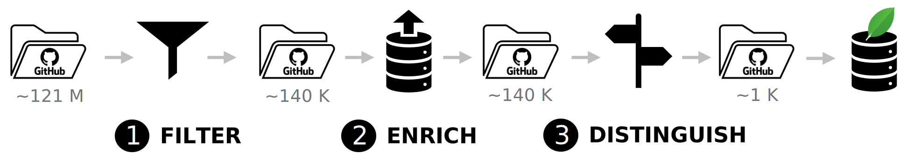

# DAIM

## 📣 Description

The "Database Analysis In Microservices" (DAIM) project helps to mine microservices applications with databases in order to analyze them in the perspective of an empirical study: "_An Empirical Study on Database Usage in Microservices_".

The following figure depict the general approach.



Technically, the project is subdivided in several processes. Each contributes to refine results according to criteria, filters, and heuristics (See [Design details](#-design-details)). Repositories are mined from GitHub using GitHub search API. Processes support multiple GitHub tokens with pooling and parallel works for performance reasons.

## ▶️ Getting started

Please consult the [INSTALL file](INSTALL.md) first.

## ⭐ Usage

### 1. Scope

The first process aims to scope the search space by generating limited ranges that exclude outliers repositories. Ranges are defined by repository sizes (minimum and maximum bounds in KB) and stars. These preliminary criteria are just a few because the [GitHub search API imposes limits in search criteria \[GitHub (2022, h)\]](https://docs.github.com/en/rest/search/search?apiVersion=2022-11-28#limitations-on-query-length). Moreover, ranges are defined to target a maximum of 1000 results each. If this limit is hit, the range is then subdivided into two subranges, and so forth recursively. Thus, ranges are generated following the manner of a dichotomous tree. This subdivision is used to deal with the [GitHub search API limits in search result access \[GitHub (2022, i)\]](https://docs.github.com/en/rest/search/search?apiVersion=2022-11-28#about-search), i.e. 1000 accessible results per request. [See selected threshold values](#scope).

- Launch the script.

  ```shell
  npm run scope
  ```

- Ranges are saved in the `ranges` MongoDB collection under the following form:

  ```json
  {
    "_id": string,
    "sizeMin": number,
    "sizeMax": number,
    "resultCount": number,
    "pageCount": number,
    "timestamp": date
  }
  ```

- Logs are available in [`/logs`](/logs/). This directory is automatically created.

### 2. Filter

The second process aims to filter the search space by targeting non-trivial repositories only. Repositories are kept based on several advanced criteria like their last commit date, their number of folders, the existence of readme files, their commit count, and their language. [See selected threshold values](#filter).

- Launch the script.

  ```shell
  npm run filter
  ```

- Repositories data are saved in the `repositories` MongoDB collection under the following form:

  ```json
  {
    "_id": string,
    "url": string,
    "branch": string,
    "owner": string,
    "title": string,
    "description": string,
    "topics": array[string],
    "creation_date": date,
    "last_updated_date": date,
    "size": number,
    "stars_count": number,
    "commits_count": number,
    "contributors_count": number,
    "folders_count": number,
    "services_directories": array[string],
    "services_files": array[string],
    "readme_files": array[string],
    "readme_files_content": array[string],
    "docker_compose_files": array[string],
    "docker_compose_files_content": array[string],
    "istio_files": array[string],
    "istio_files_content": array[string],
    "services_count": number,
    "databases": array[string],
    "languages": array[string],
    "timestamp": date,
  }
  ```

- Logs are available in [`/logs`](/logs/).

### 3. Refilter (optional)

The third process aims to refilter given repositories that were potentially aborted in the [previous process](#2-filter). Indeed, due to the lengthy duration of the process and the diversity of the targeted repositories, HTTP calls may occasionally be interrupted for various reasons (such as network issues, remote service downtime, or unauthorized access). As a result, some repositories might not be collected. In such case, they are tagged in the error logs ([`/logs/error.log`](/logs/error.log)). The refilter process helps to rerun the commands specifically for these failures cases and ensure the database is complete. This step can be skipped or stopped as long as the error logs are empty, or when the errors concern non-soluble cases.

- Launch the script.

  ```shell
  npm run refilter
  ```

- Repositories data are updated in the `repositories` MongoDB collection.

- Logs are available in [`/logs`](/logs/).

### 4. Enrich

The fourth process aims to enrich repositories already in the database with additional data like readme files content, docker-compose files content, istio files, istio files content, k8s files, k8s files content, database list, services count, etc. [See rationales](#enrich). This process is subdivided in subprocesses per file type.

- Launch the script.

  ```shell
  npm run enrich-readme
  npm run enrich-docker-compose
  npm run enrich-service-database
  ```

- Repositories data are updated in the `repositories` MongoDB collection.

- Logs are available in [`/logs`](/logs/).

### 5. Distinguish

The fifth process aims to distinguish microservice repositories from all other repositories on the basis of all mined data, to which additional criteria are applied, this time mainly related to microservices. [See rationales](#distinguish).

- Launch the script.

  ```shell
  npm run distinguish
  ```

- Microservices repositories are saved in the `repositories_microservices` MongoDB collection and in the `results/distinguish.csv` CSV file.

- Logs are available in [`/logs`](/logs/).

### 6. Analyze

The sixth process aims to derive several figures, charts, tables, and matrices from distinguished results in order to answer several questions. [See questions](#analysis). The process is subdivided in subprocesses per chart type.

- Launch the script.

  ```shell
  npm run analyze-11 // Bar chart of microservices per database sorted by microservice occurences.
  npm run analyze-12 // Bar chart of microservices per database sorted by microservices occurences and database category.
  npm run analyze-13 // Tables listing database technologies and categories and, the number of microservice occurences in each and the pourcentages.
  npm run analyze-21 // Table of databases technologies per microservice sorted by microservices occurences and database category in X and database number in Y.
  npm run analyze-22 // Table of databases categories per microservice sorted by microservices occurences and database category in X and database number in Y.
  npm run analyze-23 // Dual association matrix of databases in microservices.
  npm run analyze-24 // Association sets of databases categories in microservices.
  npm run analyze-25 // Association sets of databases technologies in microservices.
  npm run analyze-26 // Stankey diagram of databases category associations in microservices.
  npm run analyze-27 // Graph diagram of databases category associations comparing relationships between mainstream and specific databases in microservices.
  npm run analyze-28 // Scatter plot presenting microservices architectures ordered by number of services with regard to the database categories.
  npm run analyze-31 // Scatter plot of the number of services in comparison with the number databases in microservices.
  npm run analyze-32 // Scatter plot of the number of services in comparison with the number databases categories in microservices.
  npm run analyze-33 // Scatter plot of the size of microservices in comparison with the number databases in microservices.
  npm run analyze-34 // Scatter plot of the size of microservices in comparison with the number databases categories in microservices.
  npm run analyze-35 // Table of service-database ratios in microservices.
  npm run analyze-36 // Complex microservices databases selection.
  npm run analyze-41 // Scatter plot of the age of microservices in comparison with their number of databases.
  npm run analyze-42 // Scatter plot of the age of microservices in comparison with their number of databases categories.
  npm run analyze-43 // Aged microservices databases selection.
  ```

- Generated results are available in [`/src/results`](/results/).

- Logs are available in [`/logs`](/logs/).

## 🧪 Design details

The detailed approach is depicted as follow.


### Scope

Repositories are first considered to be retrievable from GitHub if they meet certain preliminary criteria targeting non-trivial repositories.

This step is implemented in [/src/process/1-scope.process.js](./src/process/1-scope.process.js).

```text

// Preliminary criteria

    size between 500..1000000 KB
&&  stars count >= 100
```

### Filter

Repositories are then retrieved from GitHub if they respect several advanced criteria targeting non-trivial repositories.

This step is implemented in [/src/process/2-filter.process.js](./src/process/2-filter.process.js). In case of re-filtering, this step is implemented in [/src/process/3-refilter.process.js](./src/process/3-refilter.process.js).

```text

// Advanced criteria

    last commit date >= 2015-01-01 [Lewis and Fowler (2014)]
&&  folders count >= 2
&&  readme files exist
&&  commit count >= 100 [d'Aragona et al. (2024)]
&&  contributor_count >= 1
&&  at least one of the most common languages in microservice [Gan et al. (2018), Gan et al. (2019), Rahman et al. (2019), d'Aragona et al. (2024), GitHub Octoverse (2024)] is used.

```

Sources: [\[Lewis and Fowler (2014)\]](https://martinfowler.com/articles/microservices.html) demonstrates when microservices became popular. [\[d'Aragona et al. (2024)\]](https://dl.acm.org/doi/10.1145/3643991.3644890) consider 100 commits as a threshold for filtering repositories. [\[Gan et al. (2018)\]](https://ieeexplore.ieee.org/abstract/document/8362750), [\[Gan et al. (2019)\]](https://dl.acm.org/doi/abs/10.1145/3297858.3304013), [\[Rahman et al. (2019)\]](https://github.com/davidetaibi/Microservices_Project_List), [\[d'Aragona et al. (2024)\]](https://dl.acm.org/doi/10.1145/3643991.3644890), [\[GitHub Octoverse (2024)\]](https://github.blog/news-insights/octoverse/octoverse-2024/) mention the most common languages in microservices.

Languages:

```text
- 'Python'
- 'C'
- 'C++'
- 'C#'
- 'Java'
- 'JavaScript'
- 'TypeScript'
- 'Scala'
- 'Go'
- 'PHP'
- 'Ruby'
```

### Enrich

Repositories are then enriched with additional data.

This step is implemented in [/src/process/4-enrich-docker-compose.process.js](./src/process/4-enrich-docker-compose.process.js), [/src/process/4-enrich-readme.process.js](./src/process/4-enrich-readme.process.js), and [/src/process/4-enrich-service-database.process.js](./src/process/4-enrich-service-database.process.js).

```text
- readme files
- docker-compose files [d'Aragona et al. (2024)]
- databases [Viennot et al. (2015), Gessert et al. (2017), Gan et al. (2018), Davoudian et al. (2018), Gan et al. (2019), Benats et al. (2021), Laigner et al. (2021), Paiva et al. (2025), DB-Engines (2025), Wikipedia (2025a), Wikipedia (2025b), Wikipedia (2025c), Wikipedia (2025d), Wikipedia (2025e), Database of Databases (2025), Docker Hub (2025)].
- services count
```

Sources: [\[d'Aragona et al. (2024)\]](https://dl.acm.org/doi/10.1145/3643991.3644890), [\[GitHub Octoverse (2024)\]](https://github.blog/news-insights/octoverse/octoverse-2024/) stress the growing popularity of Docker through all kind of repository. [\[Viennot et al. (2015)\]](https://dl.acm.org/doi/pdf/10.1145/2741948.2741975), [\[Gessert et al. (2017)\]](https://link.springer.com/article/10.1007/s00450-016-0334-3), [\[Gan et al. (2018)\]](https://ieeexplore.ieee.org/abstract/document/8362750), [\[Davoudian et al. (2018)\]](https://dl.acm.org/doi/10.1145/3158661), [\[Gan et al. (2019)\]](https://dl.acm.org/doi/abs/10.1145/3297858.3304013), [\[Benats et al. (2021)\]](https://link.springer.com/chapter/10.1007/978-3-030-89022-3_8), [\[Laigner et al. (2021)\]](https://dl.acm.org/doi/pdf/10.14778/3484224.3484232), [\[Paiva et al. (2025)\]](https://link.springer.com/article/10.1007/s10664-025-10627-z), [\[DB-Engines (2025)\]](https://db-engines.com/en/ranking), [\[Wikipedia (2025a)\]](https://en.wikipedia.org/w/index.php?title=List_of_relational_database_management_systems&oldid=1277025704), [\[Wikipedia (2025b)\]](https://en.wikipedia.org/w/index.php?title=Comparison_of_object_database_management_systems&oldid=1238176727), [\[Wikipedia (2025c)\]](https://en.wikipedia.org/w/index.php?title=Document-oriented_database&oldid=1278338966), [\[Wikipedia (2025d)\]](https://en.wikipedia.org/w/index.php?title=List_of_column-oriented_DBMSes&oldid=1241929445), [\[Wikipedia (2025e)\]](https://en.wikipedia.org/w/index.php?title=List_of_in-memory_databases&oldid=1269217579), [\[Database of Databases (2025)\]](https://dbdb.io/), [\[Docker Hub (2025)\]](https://hub.docker.com/) mention popular databases technologies.

---

<details>
<summary>Database list and related Regular Expression here</summary>

```text
// Relational

- Oracle: '(oracle/database|oracle-([0-9]*-)*xe|container-registry.oracle.com/database/free|oracle-free)'
- MySQL: 'mysql'
- Microsoft Server SQL: 'mssql'
- PostgreSQL: 'postgres'
- IBM DB2: '(-db2|/db2)'
- SQLite: 'sqlite'
- Microsoft Access
- MariaDB: 'mariadb'
- Microsoft Azure SQL Edge: 'azure-sql-edge'
- FileMaker
- SAP Hana: 'saplabs/hanaexpress'
- Teradata: 'teradata'
- SAP Adaptive Server Enterprise, ASE, Sybase, SQL Server, IQ, SQL Anywhere: '(-sybase|/sybase)'
- Firebird: 'firebird'
- IBM Informix: 'informix'
- DBase: '(-dbase|/dbase)'
- H2: 'h2database'
- SingleStore: 'singlestore'
- CockroachDB: 'cockroachdb'
- TiDB: 'tidb'
- OpenEdge: 'progresssoftware/prgs-oedb'
- InterBase: 'interbase'
- Ingres: '/ingres'
- HyperSQL: '(hsqldb|hypersql)'
- Google Cloud Spanner: 'cloud-spanner'
- OceanBase: 'oceanbase'
- Yugabytedb: 'yugabytedb'
- SAP MaxDB: 'maxdb'
- Citus: 'citusdata'
- EXASOL: 'exasol'
- Datomic: 'datomic'
- Empress
- Tibero: 'tibero'
- mSQL, MiniSQL: '(-msql|/msql)'
- VoltDB: 'voltdb'
- PolarDB: 'polardb'
- HFSQL: 'hfsql'
- TimesTen: 'timesten'
- eXtremeDB: 'extremedb'
- MatrixOne: 'matrixone'
- SQLBase: 'sqlbase'
- OpenGauss: 'opengauss'
- DataEase: 'dataease'
- NonStop SQL
- Cubrid: 'cubrid'
- Rockset: 'rockset'
- Altibase: 'altibase'
- Infobright: 'infobright'
- NuoDB: 'nuodb'
- Dolt: 'dolthub'
- Actian Vector: 'actian/vector'
- Datacom/DB
- RisingWave: 'risingwave'
- SQream DB: 'sqream'
- Frontbase: 'frontbase'
- SolidDB
- R:BASE
- Kingbase: 'kingbase'
- YDB: 'ydbplatform'
- NexusDB: 'nexusdb'

// Document

- MongoDB: '(mongodb|mongo)'
- Couchbase: 'couchbase'
- Google Firebase, Google Firestore
- CouchDB: 'couchdb'
- Realm: '(-realm|/realm)'
- MarkLogic: 'marklogic'
- Google Cloud Datastore
- RavenDB: 'ravendb'
- IBM Cloudant: 'cloudant'
- RethinkDB: 'rethinkdb'
- PouchDB: 'pouchdb'
- Amazon DocumentDB: 'documentdb'
- LiteDB: 'litedb'
- BigchainDB: 'bigchaindb'
- CrateDB: 'crate'
- HarperDB: 'harperdb'

// Key-Value

- Redis: 'redis'
- Memcached: 'memcached'
- etcd: 'etcd'
- Riak KV: 'riak-kv'
- RocksDB: 'rocksdb'
- Microsoft Azure Table Storage
- Apache Accumulo: 'accumulo'
- LevelDB: 'leveldb'
- Infinispan: 'infinispan'
- IBM LMDB: '/lmdb'
- Amazon SimpleDB: 'simpledb'
- Apache Geode: 'geode'
- Valkey: 'valkey'
- NCache: '/ncache'
- GT.M: 'tsafin/fis-gtm-env'
- KeyDB: 'keydb'
- BoltDB: 'boltdb'
- Dragonfly: 'dragonflydb'

// Column

- Apache Cassandra: 'cassandra'
- HBase:'hbase'
- ClickHouse: 'clickhouse'
- DuckDB: 'duckdb'
- DataStax: 'datastax'
- ScyllaDB: 'scylladb'
- Apache Druid: 'apache/druid'
- MonetDB: 'monetdb'
- GBase: '/gbase'
- StarRocks: 'starrocks'
- SciDB: 'scidb'
- Splice Machine: 'splicemachine'
- Atoti: 'atoti'

// Graph

- Neo4j: 'neo4j'
- GraphDB: 'graphdb'
- Memgraph: 'memgraph'
- Amazon Neptune
- JanusGraph: 'janusgraph'
- Stardog: 'stardog'
- Nebula: 'nebula-graphd'
- TigerGraph: 'tigergraph'
- Dgraph: 'dgraph'
- Blazegraph: 'blazegraph'

// Time series

- InfluxDB: 'influxdb'
- kdb+: '(-kdb|/kdb)'
- TimescaleDB: 'timescaledb'
- QuestDB: 'questdb'
- GridDB: 'griddb'
- TDengine: 'tdengine'
- RRDtool: 'rrdtool'
- Apache IoTDB: 'iotdb'
- OpenTSDB: 'opentsdb'
- Amazon Timestream: 'timestream'
- M3DB: 'm3db'
- KairosDB: 'kairosdb'

// Vector

- Pinecone : 'pinecone'
- Milvus: 'milvus'
- Qdrant: 'qdrant'
- Chroma: 'chromadb'
- Weaviate: 'weaviate'

// Spatial

- PostGIS: 'postgis'
- GeoMesa: 'geomesa'

// Hierarchical

- IBM IMS

// Network

- IDMS

// Object

- Actian NoSQL Database: 'actian/nsql'
- Db4o: 'db4o'
- ObjectStore: 'objectstore'
- ZODB: 'zodb'
- ObjectDB: 'objectdb'
- Objectivity/DB: 'objectivity'

// Event

- EventstoreDB: 'eventstore'

// Search

- Elasticsearch: 'elasticsearch'
- Splunk: 'splunk'
- Apache Solr: '(solr:|/solr|-solr)'
- OpenSearch: 'opensearch'
- Algolia: 'algolia'
- Amazon CloudSearch: 'cloudsearch'
- Meilisearch: 'meilisearch'
- Typesense: 'typesense'
- Vespa: 'vespaengine'

// Others

- Amazon DynamoDB: 'dynamodb'
- Azure Cosmos DB: 'cosmosdb'
- Vertica: '(vertica/|demisto/vertica)'
- Aerospike: 'aerospike'
- Oracle NoSQL: 'oracle/nosql'
- Virtuoso: 'virtuoso'
- Apache Ignite: 'apacheignite/ignite'
- ArangoDB: 'arangodb'
- Adabas: 'adabas'
- OrientDB: 'orientdb'
- DolphinDB: 'dolphindb'
- UniData, Universe
- Fauna: 'fauna'
- D3, TigerLogic D3, Rocket D3
- BaseX: 'basex'
- GridGain: 'gridgain'
- Mnesia: '(-mnesia|/mnesia)'
- ObjectBox: 'objectboxio'
- SurrealDB: 'surrealdb'
- FoundationDB: 'foundationdb'
- RDF4J: 'rdf4j'
- AllegroGraph: 'allegrograph'
- Model 204
- eXist-db: 'existdb'
- TypeDB: 'typedb'
- Sedna

Count: 180
```

</details>

---

Note: This list was extracted from [\[DB-Engines (2025)\]](https://db-engines.com/en/ranking)'s ranking. Only top 250 DBMS (not additional services, platforms, frameworks, warehouses, etc.) were retained. The databases are sorted first by type (Relational, Document, Key-Value, Column, Graph, Time Series, Vector, Spatial, Hierarchical, Network, Object, Event, Search Engine) and then by popularity according to DB-Engines. Informations and classifications was cross-checked by description given on [\[Database of Databases (2025)\]](https://dbdb.io/), Google, Wikipedia, and even DockerHub [\[Docker Hub (2025)\]](https://hub.docker.com/). In case of less famous (e.g., Native XML, RDF, etc.), multiple, unclear or disagreements in type classification, databases were sorted in the 'Others' category. For each database, a regular expression is associated to identify the corresponding Docker image if such images exists.

### Distinguish

Repositories are then distinguished thanks to a scoring and some heuristics.

This step is implemented in [/src/process/5-distinguish.process.js](./src/process/5-distinguish.process.js).

```text

// Score

- count of inclusive keywords in the title >= 1 ? -> +1
- count of inclusive keywords in the description >= 1 ? -> +1
- count of inclusive keywords in the topic(s) >= 1 ? -> +1
- count of inclusive keywords in the readme(s) >= 1 ? -> +1
- count of service(s) directorie(s) >= 1 ? -> +1
- count of service(s) file(s) >= 1 ? -> +1
- count of docker-compose file(s) >= 1 ? -> +1
- count of services in docker-compose file(s) >= 1 ? -> +1
- count of databases technologies in docker-compose file(s) >= 1 ? -> +1

// Heuristics

    count of docker-compose file(s) >= 1
&&  count of services >= 1
&&  count of inclusive keywords in the title, the description, the topic(s), or the readme >= 1
&&  count of databases technologies in docker-compose file(s) >= 1
&&  count of services > count of databases technologies in docker-compose files(s)
&&  score >= 1

```

Inclusive keywords:

```text
- 'microservice'
- 'microservices'
- 'micro-service'
- 'micro-services'
- 'micro service'
- 'micro services'
- 'rest api'
- 'monorepo'
- 'mono-repo'
- 'multirepo'
- 'multi-repo'
```

### Analyze

Repositories are finally analyzed through several research questions.

```text

// Research Questions

- RQ1: What database categories and technologies are used in microservices, and how prevalent are they?
- RQ2: How are databases combined in microservices, and what are the characteristics of those combinations?
- RQ3: What is the relationship between the complexity of microservices and their data management strategy?
- RQ4: What is the relationship between the age of microservices and their database choices?
```

This step is implemented in :

- [/src/process/6-analyze-1.1.process.js](./src/process/6-analyze-1.1.process.js).
- [/src/process/6-analyze-1.2.process.js](./src/process/6-analyze-1.2.process.js).
- [/src/process/6-analyze-1.3.process.js](./src/process/6-analyze-1.3.process.js).
- [/src/process/6-analyze-2.1.process.js](./src/process/6-analyze-2.1.process.js).
- [/src/process/6-analyze-2.2.process.js](./src/process/6-analyze-2.2.process.js).
- [/src/process/6-analyze-2.3.process.js](./src/process/6-analyze-2.3.process.js).
- [/src/process/6-analyze-2.4.process.js](./src/process/6-analyze-2.4.process.js).
- [/src/process/6-analyze-2.5.process.js](./src/process/6-analyze-2.5.process.js).
- [/src/process/6-analyze-2.6.process.js](./src/process/6-analyze-2.6.process.js).
- [/src/process/6-analyze-2.7.process.js](./src/process/6-analyze-2.7.process.js).
- [/src/process/6-analyze-2.8.process.js](./src/process/6-analyze-2.8.process.js).
- [/src/process/6-analyze-3.1.process.js](./src/process/6-analyze-3.1.process.js).
- [/src/process/6-analyze-3.2.process.js](./src/process/6-analyze-3.2.process.js).
- [/src/process/6-analyze-3.2.process.js](./src/process/6-analyze-3.3.process.js).
- [/src/process/6-analyze-3.4.process.js](./src/process/6-analyze-3.4.process.js).
- [/src/process/6-analyze-3.5.process.js](./src/process/6-analyze-3.5.process.js).
- [/src/process/6-analyze-3.6.process.js](./src/process/6-analyze-3.6.process.js).
- [/src/process/6-analyze-4.1.process.js](./src/process/6-analyze-4.1.process.js).
- [/src/process/6-analyze-4.2.process.js](./src/process/6-analyze-4.2.process.js).
- [/src/process/6-analyze-4.3.process.js](./src/process/6-analyze-4.3.process.js).

Source: [\[Laigner et al. (2021)\]](https://dl.acm.org/doi/pdf/10.14778/3484224.3484232) and [\[Benats et al. (2021)\]](https://link.springer.com/chapter/10.1007/978-3-030-89022-3_8) was used to define research questions. [\[Decrop et al. (2025)\]](https://pure.unamur.be/ws/portalfiles/portal/106749271/msr2025-technical-p115.pdf) and [\[d'Aragona et al. (2024)\]](https://dl.acm.org/doi/10.1145/3643991.3644890) were used for defining the application purpose types.

## 👩‍💻 Development details

### Setup

See [INSTALL file](INSTALL.md).

### Structure of this repository

- `README.md`: This file.
- `INSTALL.md`: Describes the installation strategies of this mining and analysis implementation.
- `/doc`: Contains the approach diagrams.
- `/src`: Contains the implementation of the mining and the analysis.
  - `/constant`: Contains the constants used for the mining and the analysis, e.g., the database name, the database categories, the database category colors, etc.
  - `/dao`: Contains the connection to the MongoDB database for saving mined results.
  - `/helper`: Contains the helpers used for the GitHub mining and the related logging process.
  - `/model`: Contains the model used for the GitHub mining.
  - `/process`: Contains the implementation of the mining and analysis processes. Each is called thanks to the corresponding `npm run ...` command. Each is described [here](README.md#-usage).
- `/results`: Contains the generated HTML files with the figures, charts, tables, and matrices. It also contains the mining database dump. Please install Git LFS (see [INSTALL.md](INSTALL.md)).
- `.env_sample`: Exemplifies the `.env` file to create.
- `Dockerfile`: Describes the Docker containerization.
- `docker-compose.yml`: Eases the Docker containerization.
- `package.json`: Describes, among others, in the `scripts` property, the `npm run ...` commands for the mining and analyses processes.

## 🪛 Technical details

### Technologies

- JavaScript
- Docker

### Libraries

- [axios](https://www.npmjs.com/axios) is the package for HTTP calls.
- [dotenv](https://www.npmjs.com/dotenv) is the package for environment variables.
- [yaml](https://www.npmjs.com/yaml) is the package for the YAML parsing.
- [mongodb](https://www.npmjs.com/mongodb) is the package for the database persistence.
- [winston](https://www.npmjs.com/winston) is the package for the logging.
- [csv-writer](https://www.npmjs.com/csv-writer) is the package for writing CSV files.
